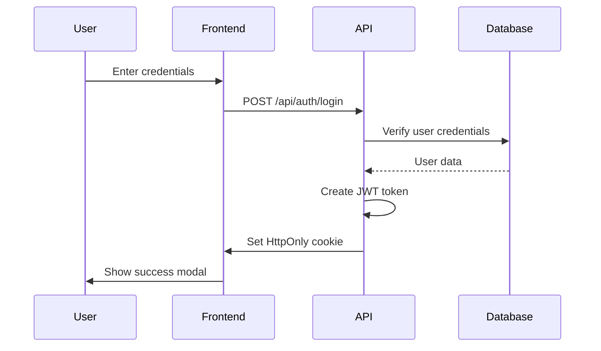

# PagesAI Developer Documentation

This comprehensive guide is designed for junior developers to understand and work effectively on the PagesAI project. It covers architecture, patterns, conventions, and practical examples.

## 📚 Table of Contents

1. [Project Overview](#project-overview)
2. [Architecture & Patterns](#architecture--patterns)
3. [Development Environment](#development-environment)
4. [Code Organization](#code-organization)
5. [Authentication System](#authentication-system)
6. [Image Management System](#image-management-system)
7. [Database & Prisma](#database--prisma)
8. [UI Components & Styling](#ui-components--styling)
9. [API Routes](#api-routes)
10. [API Documentation](#api-documentation)
11. [Code Quality & Formatting](#code-quality--formatting)
12. [Testing Strategy](#testing-strategy)
13. [Common Tasks](#common-tasks)
14. [Debugging Guide](#debugging-guide)
15. [Best Practices](#best-practices)
16. [Troubleshooting](#troubleshooting)

## 🎯 Project Overview

PagesAI is a modern web application built with Next.js 15 and React 19. It follows a full-stack architecture with:

- **Frontend**: React components with TypeScript
- **Backend**: Next.js API routes
- **Database**: SQLite with Prisma ORM
- **Authentication**: JWT-based with secure cookies
- **Styling**: Tailwind CSS with shadcn/ui components
- **API Documentation**: OpenAPI 3.1 with interactive Swagger UI

### Key Principles

1. **Type Safety**: Everything is typed with TypeScript
2. **Security First**: Secure authentication and input validation
3. **Testability**: Comprehensive test coverage
4. **Accessibility**: WCAG compliant components
5. **Performance**: Optimized for speed and user experience

## 🏗️ Architecture & Patterns

### Next.js 15 App Router Structure

```
app/
├── (auth)/              # Route group for authentication pages
│   └── login/           # Login page at /login
├── api/                 # API routes
│   ├── auth/            # Authentication endpoints
│   ├── upload/          # File upload endpoints
│   │   └── image/       # Image upload endpoint
│   └── openapi.json/    # OpenAPI specification endpoint
├── docs/                # API documentation page
├── globals.css          # Global styles
├── layout.tsx           # Root layout component
└── page.tsx             # Home page at /
```

### Component Architecture

```
src/
├── components/
│   ├── ui/              # Reusable UI components (shadcn/ui)
│   ├── auth/            # Authentication-specific components
│   └── editor/          # TipTap editor components
├── lib/                 # Utilities and configurations
│   ├── auth.ts          # JWT and session management
│   ├── db.ts            # Database connection
│   ├── openapi.ts       # OpenAPI specification generator
│   ├── password.ts      # Password hashing utilities
│   ├── validators/      # Zod validation schemas
│   │   ├── auth.ts      # Authentication schemas
│   │   └── api.ts       # API response schemas
│   └── utils.ts         # General utilities
└── server/              # Server-side utilities
    └── auth.ts          # Server authentication helpers
```

### Static Assets Structure

```
public/
├── uploads/             # Image uploads storage
├── favicon.ico         # Site favicon
├── favicon.svg         # SVG favicon
├── icon.svg            # App icon
└── robots.txt          # SEO robots file
```

### Data Flow Pattern

1. **User Input** → Form validation (Zod)
2. **API Request** → Route handler validation
3. **Database Query** → Prisma ORM
4. **Response** → Type-safe data
5. **UI Update** → React state management

## 🛠️ Development Environment

### Prerequisites

- **Node.js**: Version 22 LTS or higher
- **npm**: Version 10 or higher
- **Git**: For version control
- **VS Code**: Recommended IDE with extensions

### Required VS Code Extensions

```json
{
  "recommendations": [
    "bradlc.vscode-tailwindcss",
    "esbenp.prettier-vscode",
    "ms-vscode.vscode-typescript-next",
    "prisma.prisma",
    "vitest.explorer"
  ]
}
```

### Environment Setup

1. **Clone and Install**

   ```bash
   git clone <repository-url>
   cd pagesai
   npm install
   ```

2. **Environment Variables**

   ```bash
   # Environment variables are already configured in .env.local
   # Edit .env.local with your values
   ```

3. **Database Setup**

   ```bash
   npm run db:generate  # Generate Prisma client
   npm run db:push      # Create database
   npm run db:seed      # Add test data
   ```

4. **Start Development**
   ```bash
   npm run dev
   ```

## 📁 Code Organization

### File Naming Conventions

- **Components**: PascalCase (`LoginForm.tsx`)
- **Pages**: lowercase (`page.tsx`)
- **Utilities**: camelCase (`auth.ts`)
- **Types**: PascalCase (`User.ts`)
- **Tests**: `.test.ts` or `.test.tsx`

### Import Organization

```typescript
// 1. React and Next.js imports
import React from 'react';
import { NextRequest, NextResponse } from 'next/server';

// 2. Third-party libraries
import { z } from 'zod';
import bcrypt from 'bcryptjs';

// 3. Internal imports (absolute paths)
import { db } from '@/lib/db';
import { Button } from '@/components/ui/button';

// 4. Relative imports
import './styles.css';
```

### TypeScript Patterns

#### Interface vs Type

```typescript
// Use interface for object shapes
interface User {
  id: string;
  username: string;
  email?: string;
}

// Use type for unions and primitives
type Status = 'pending' | 'success' | 'error';
type UserRole = 'admin' | 'user';
```

#### Generic Types

```typescript
// API Response wrapper
interface ApiResponse<T> {
  success: boolean;
  data?: T;
  error?: string;
}

// Usage
const userResponse: ApiResponse<User> = await fetch('/api/user');
```

## 🔐 Authentication System

### JWT Token Flow



### Session Management

```typescript
// Creating a session
export async function createSession(userId: string, username: string) {
  const expiresAt = new Date(Date.now() + 7 * 24 * 60 * 60 * 1000); // 7 days
  const session = await encrypt({
    userId,
    username,
    iat: Date.now(),
    exp: expiresAt.getTime(),
  });

  cookies().set('session', session, {
    httpOnly: true,
    secure: process.env.NODE_ENV === 'production',
    expires: expiresAt,
    sameSite: 'lax',
    path: '/',
  });
}
```

### Password Security

```typescript
// Hashing passwords
export async function hashPassword(password: string): Promise<string> {
  return bcrypt.hash(password, 12); // Cost factor 12
}

// Verifying passwords
export async function verifyPassword(
  password: string,
  hashedPassword: string
): Promise<boolean> {
  return bcrypt.compare(password, hashedPassword);
}
```

### Authentication Middleware

```typescript
// Server-side user retrieval
export async function getUser() {
  const session = cookies().get('session')?.value;
  if (!session) return null;

  const payload = await decrypt(session);
  if (!payload) return null;

  return await db.user.findUnique({
    where: { id: payload.userId },
    select: {
      id: true,
      username: true,
      email: true,
      createdAt: true,
    },
  });
}
```

## 🖼️ Image Management System

### Image Storage Architecture

PagesAI uses a file-based image storage system that saves uploaded images as files in the `public/uploads/` directory rather than storing them as base64 data in the database.

#### Storage Location

**Development**: `D:\gitrepos\pagesai\public\uploads\`

**Directory Structure**:
```
public/
├── uploads/              ← Images stored here
│   ├── 1737123456789-abc123def456.jpg
│   ├── 1737123456790-xyz789ghi012.png
│   └── ...
├── favicon.ico
└── ...
```

#### Upload API Endpoint

```typescript
// app/api/upload/image/route.ts
export async function POST(request: NextRequest) {
  try {
    const formData = await request.formData();
    const file = formData.get('image') as File;
    
    // Validate file type and size
    if (!file.type.startsWith('image/')) {
      return NextResponse.json({ error: 'File must be an image' }, { status: 400 });
    }
    
    if (file.size > 5 * 1024 * 1024) { // 5MB limit
      return NextResponse.json({ error: 'File size must be less than 5MB' }, { status: 400 });
    }

    // Generate unique filename
    const timestamp = Date.now();
    const randomString = Math.random().toString(36).substring(2, 15);
    const extension = file.name.split('.').pop();
    const filename = `${timestamp}-${randomString}.${extension}`;
    
    // Save file to uploads directory
    const uploadsDir = join(process.cwd(), 'public', 'uploads');
    const filePath = join(uploadsDir, filename);
    const bytes = await file.arrayBuffer();
    await writeFile(filePath, Buffer.from(bytes));

    // Return public URL
    const imageUrl = `/uploads/${filename}`;
    return NextResponse.json({ success: true, imageUrl, filename });
  } catch (error) {
    return NextResponse.json({ error: 'Failed to upload image' }, { status: 500 });
  }
}
```

#### Image Modal Component

```typescript
// src/components/editor/image-modal.tsx
const handleSubmit = async () => {
  if (selectedFile) {
    // Upload file to server
    const formData = new FormData();
    formData.append('image', selectedFile);
    
    const response = await fetch('/api/upload/image', {
      method: 'POST',
      body: formData,
    });
    
    const result = await response.json();
    const imageSrc = result.imageUrl;
    
    // Insert image into editor
    editor.chain().focus().setImage({ src: imageSrc }).run();
  }
};
```

#### File Naming Convention

- **Pattern**: `{timestamp}-{randomString}.{extension}`
- **Example**: `1737123456789-abc123def456.jpg`
- **Timestamp**: Current time in milliseconds for uniqueness
- **Random String**: 13-character random string for collision avoidance
- **Extension**: Original file extension preserved

#### Access Methods

- **Local Development**: `http://localhost:3001/uploads/filename.jpg`
- **Production**: `https://yourdomain.com/uploads/filename.jpg`
- **File System**: Direct access via `public/uploads/` directory

#### Benefits of File-Based Storage

1. **Performance**: Images served as static assets (faster than database queries)
2. **Scalability**: No database size limits for image content
3. **Persistence**: Images remain available across page navigation
4. **Efficiency**: No base64 encoding/decoding overhead
5. **Caching**: Browser caching for improved performance
6. **CDN Ready**: Easy to integrate with CDN services

#### Integration with TipTap Editor

```typescript
// Images are inserted with proper URLs
editor.chain().focus().setImage({ src: '/uploads/filename.jpg' }).run();

// HTML output

```

#### Security Considerations

- **File Type Validation**: Only image files accepted
- **Size Limits**: 5MB maximum file size
- **Unique Filenames**: Prevents filename collisions
- **Public Directory**: Images accessible via HTTP (consider authentication for sensitive images)

## 🗄️ Database & Prisma

### Schema Definition

```prisma
model User {
  id        String   @id @default(cuid())
  username  String   @unique
  password  String
  email     String?  @unique
  createdAt DateTime @default(now())
  updatedAt DateTime @updatedAt

  @@map("users")
}
```

### Database Operations

```typescript
// Creating a user
const user = await db.user.create({
  data: {
    username: 'newuser',
    password: await hashPassword('password123'),
    email: 'user@example.com',
  },
});

// Finding a user
const user = await db.user.findUnique({
  where: { username: 'testuser' },
});

// Updating a user
const updatedUser = await db.user.update({
  where: { id: userId },
  data: { email: 'newemail@example.com' },
});
```

### Database Scripts

```bash
# Generate Prisma client after schema changes
npm run db:generate

# Push schema changes to database (development)
npm run db:push

# Create and run migrations (production)
npm run db:migrate

# Seed database with test data
npm run db:seed

# Open Prisma Studio (database GUI)
npm run db:studio
```

## 🎨 UI Components & Styling

### shadcn/ui Components

The project uses shadcn/ui components built on Radix UI primitives:

```typescript
// Button component usage
<Button variant="default" size="lg" onClick={handleClick}>
  Click me
</Button>

// Input with label
<div className="space-y-2">
  <Label htmlFor="username">Username</Label>
  <Input
    id="username"
    type="text"
    placeholder="Enter your username"
    value={username}
    onChange={(e) => setUsername(e.target.value)}
  />
</div>
```

### Tailwind CSS Patterns

```typescript
// Responsive design
<div className="w-full max-w-md mx-auto p-4 sm:p-6 lg:p-8">

// Conditional styling
<button className={cn(
  "px-4 py-2 rounded",
  isActive ? "bg-blue-500 text-white" : "bg-gray-200 text-gray-700"
)}>

// Component variants
const buttonVariants = cva(
  "inline-flex items-center justify-center rounded-md text-sm font-medium",
  {
    variants: {
      variant: {
        default: "bg-primary text-primary-foreground hover:bg-primary/90",
        destructive: "bg-destructive text-destructive-foreground hover:bg-destructive/90",
      },
      size: {
        default: "h-10 px-4 py-2",
        sm: "h-9 rounded-md px-3",
        lg: "h-11 rounded-md px-8",
      },
    },
  }
)
```

### Form Handling

```typescript
// Form with validation
const [formData, setFormData] = useState<LoginInput>({
  username: '',
  password: '',
});
const [errors, setErrors] = useState<Partial<LoginInput>>({});

const handleSubmit = async (e: React.FormEvent) => {
  e.preventDefault();

  try {
    const validatedData = loginSchema.parse(formData);
    // Process form data
  } catch (error) {
    if (error instanceof z.ZodError) {
      setErrors(error.flatten().fieldErrors);
    }
  }
};
```

## 🛣️ API Routes

### Route Handler Structure

```typescript
// app/api/auth/login/route.ts
import { NextRequest, NextResponse } from 'next/server';
import { authenticateUser } from '@/server/auth';
import { createSession } from '@/lib/auth';
import { loginSchema } from '@/lib/validators/auth';

export async function POST(request: NextRequest) {
  try {
    const body = await request.json();
    const validatedData = loginSchema.parse(body);
    const user = await authenticateUser(
      validatedData.username,
      validatedData.password
    );
    await createSession(user.id, user.username);

    return NextResponse.json({ success: true, user }, { status: 200 });
  } catch (error) {
    return NextResponse.json({ error: 'Invalid credentials' }, { status: 401 });
  }
}
```

### Available Endpoints

- `POST /api/auth/login` - Authenticate user and create session
- `POST /api/auth/logout` - Terminate user session
- `GET /api/openapi.json` - OpenAPI specification
- `GET /docs` - Interactive API documentation

### Error Handling Patterns

```typescript
// Consistent error responses
interface ErrorResponse {
  error: string;
  details?: Record<string, string>;
}

// Error handling utility
function handleApiError(error: unknown): NextResponse {
  if (error instanceof z.ZodError) {
    return NextResponse.json(
      { error: 'Validation failed', details: error.flatten().fieldErrors },
      { status: 400 }
    );
  }

  if (error instanceof Error) {
    return NextResponse.json({ error: error.message }, { status: 500 });
  }

  return NextResponse.json({ error: 'Internal server error' }, { status: 500 });
}
```

## 📚 API Documentation

### OpenAPI Integration

PagesAI uses a **Zod-first approach** for API documentation, where Zod schemas serve as the single source of truth for both validation and documentation.

#### Key Components

1. **Enhanced Zod Schemas** (`src/lib/validators/auth.ts`)
2. **OpenAPI Generator** (`src/lib/openapi.ts`)
3. **API Specification Endpoint** (`/api/openapi.json`)
4. **Interactive Documentation** (`/docs`)

### Zod Schema Enhancement

```typescript
import { z } from 'zod';
import { extendZodWithOpenApi } from '@asteasolutions/zod-to-openapi';

extendZodWithOpenApi(z);

export const loginSchema = z
  .object({
    username: z.string().min(1, 'Username is required').openapi({
      description: 'User login identifier',
      example: 'testuser',
    }),
    password: z.string().min(1, 'Password is required').openapi({
      description: 'User password',
      example: 'password123',
    }),
  })
  .openapi({
    title: 'Login Request',
    description: 'User login credentials',
  });
```

### OpenAPI Specification Generation

```typescript
// src/lib/openapi.ts
import {
  OpenAPIRegistry,
  OpenApiGeneratorV31,
} from '@asteasolutions/zod-to-openapi';

const registry = new OpenAPIRegistry();

registry.registerPath({
  method: 'post',
  path: '/api/auth/login',
  description: 'Authenticate user and create session',
  tags: ['Authentication'],
  request: {
    body: {
      content: {
        'application/json': {
          schema: loginSchema,
        },
      },
    },
  },
  responses: {
    200: {
      description: 'Login successful',
      content: {
        'application/json': {
          schema: loginSuccessResponseSchema,
        },
      },
    },
    // ... other responses
  },
});

const generator = new OpenApiGeneratorV31(registry.definitions);
export const openApiSpec = generator.generateDocument({
  openapi: '3.1.0',
  info: {
    title: 'PagesAI API',
    description: 'Authentication API for PagesAI application',
    version: '1.0.0',
  },
  // ... other configuration
});
```

### Interactive Documentation

The Swagger UI is available at `/docs` and provides:

- **Real-time API testing** - Test endpoints directly from the browser
- **Schema exploration** - View request/response schemas
- **Example requests** - Pre-filled examples for each endpoint
- **Error documentation** - Detailed error response information

### Documentation Workflow

1. **Define Zod Schema** with OpenAPI metadata
2. **Register API Path** in the OpenAPI registry
3. **Generate Specification** automatically from schemas
4. **Serve Documentation** via `/api/openapi.json` and `/docs`

### Benefits

- **Single Source of Truth**: Zod schemas define both validation and documentation
- **Automatic Updates**: Documentation updates automatically when schemas change
- **Type Safety**: Full TypeScript support throughout the pipeline
- **Zero Maintenance**: No separate documentation files to maintain
- **Professional Interface**: Industry-standard Swagger UI

### Adding New Endpoints

To add a new API endpoint with documentation:

1. **Create Zod Schema** with OpenAPI metadata
2. **Register Path** in `src/lib/openapi.ts`
3. **Implement Route Handler** in `app/api/`
4. **Documentation Updates Automatically**

Example:

```typescript
// 1. Create schema
export const userProfileSchema = z.object({
  name: z.string().openapi({ description: 'User full name' }),
  email: z.string().email().openapi({ description: 'User email' }),
});

// 2. Register in openapi.ts
registry.registerPath({
  method: 'put',
  path: '/api/user/profile',
  description: 'Update user profile',
  request: {
    body: { content: { 'application/json': { schema: userProfileSchema } } },
  },
  responses: { 200: { description: 'Profile updated' } },
});

// 3. Implement route handler
// app/api/user/profile/route.ts
export async function PUT(request: NextRequest) {
  // Implementation
}
```

## 🎨 Code Quality & Formatting

### ESLint Configuration

PagesAI uses ESLint with Next.js, TypeScript, and Prettier integration for comprehensive code quality enforcement.

#### Configuration Files

- **`eslint.config.js`**: Main ESLint configuration with Prettier integration
- **`.prettierrc`**: Prettier formatting rules
- **`.prettierignore`**: Files to exclude from Prettier formatting

#### ESLint Rules

```javascript
// eslint.config.js
{
  rules: {
    'prettier/prettier': 'error',
    '@typescript-eslint/no-unused-vars': 'error',
    '@typescript-eslint/no-explicit-any': 'warn',
    'prefer-const': 'error',
    'no-var': 'error',
  },
}
```

### Prettier Configuration

#### Formatting Rules

```json
{
  "semi": true,
  "trailingComma": "es5",
  "singleQuote": true,
  "printWidth": 80,
  "tabWidth": 2,
  "useTabs": false,
  "bracketSpacing": true,
  "bracketSameLine": false,
  "arrowParens": "avoid",
  "endOfLine": "lf",
  "quoteProps": "as-needed",
  "jsxSingleQuote": true,
  "proseWrap": "preserve"
}
```

### Available Scripts

```bash
# Linting
npm run lint          # Run ESLint
npm run lint:fix      # Fix ESLint issues automatically

# Formatting
npm run format        # Format all files with Prettier
npm run format:check  # Check if files are formatted correctly
```

### IDE Integration

#### VS Code Setup

1. Install extensions:
   - **ESLint** (`ms-vscode.vscode-eslint`)
   - **Prettier** (`esbenp.prettier-vscode`)

2. Add to `.vscode/settings.json`:

```json
{
  "editor.formatOnSave": true,
  "editor.defaultFormatter": "esbenp.prettier-vscode",
  "editor.codeActionsOnSave": {
    "source.fixAll.eslint": true
  },
  "eslint.validate": ["javascript", "typescript", "jsx", "tsx"]
}
```

### Pre-commit Hooks (Recommended)

Install `husky` and `lint-staged` for automatic formatting:

```bash
npm install --save-dev husky lint-staged
npx husky init
```

Add to `package.json`:

```json
{
  "lint-staged": {
    "*.{js,jsx,ts,tsx}": ["eslint --fix", "prettier --write"],
    "*.{json,md,css}": ["prettier --write"]
  }
}
```

### Code Quality Workflow

1. **Write Code** → Follow TypeScript and ESLint rules
2. **Auto-format** → Prettier formats on save
3. **Lint Check** → ESLint catches issues
4. **Pre-commit** → Automatic formatting and linting
5. **CI/CD** → Automated quality checks

### Best Practices

#### Code Style

- Use **single quotes** for strings
- Use **semicolons** consistently
- **2 spaces** for indentation
- **80 character** line limit
- **Trailing commas** in ES5-compatible locations

#### TypeScript

- Enable **strict mode**
- Avoid `any` type
- Use **explicit return types** for functions
- Prefer **interfaces** over types for object shapes

#### React/Next.js

- Use **functional components** with hooks
- Implement **proper error boundaries**
- Use **Server Components** by default
- Add `'use client'` only when necessary

## 🧪 Testing Strategy

### Test Structure

```
tests/
├── setup.ts                 # Test configuration
├── lib/                     # Library tests
│   ├── password.test.ts     # Password utility tests
│   └── validators/          # Validation tests
├── components/              # Component tests
│   └── auth/                # Auth component tests
└── app/                     # App/page tests
```

### Testing Patterns

```typescript
// Component testing
import { render, screen, fireEvent, waitFor } from '@testing-library/react'
import userEvent from '@testing-library/user-event'

describe('LoginForm', () => {
  it('should handle successful login', async () => {
    const user = userEvent.setup()
    const mockResponse = { ok: true, json: () => Promise.resolve({ success: true }) }
    global.fetch = vi.fn().mockResolvedValue(mockResponse)

    render(<LoginForm />)

    await user.type(screen.getByTestId('username-input'), 'testuser')
    await user.type(screen.getByTestId('password-input'), 'password123')
    await user.click(screen.getByTestId('sign-in-button'))

    await waitFor(() => {
      expect(screen.getByText('Login Successful!')).toBeInTheDocument()
    })
  })
})
```

### Mocking Patterns

```typescript
// Mock external dependencies
vi.mock('bcryptjs', () => ({
  hash: vi.fn(),
  compare: vi.fn(),
}));

// Mock API calls
global.fetch = vi.fn();

// Mock Next.js functions
vi.mock('next/headers', () => ({
  cookies: vi.fn(() => ({
    get: vi.fn(),
    set: vi.fn(),
    delete: vi.fn(),
  })),
}));
```

## 🔧 Common Tasks

### Adding a New API Route

1. **Create route file**: `app/api/feature/route.ts`
2. **Add validation schema**: `src/lib/validators/feature.ts`
3. **Implement handler**: Use NextRequest/NextResponse
4. **Add tests**: `tests/api/feature.test.ts`
5. **Update documentation**

### Creating a New Component

1. **Create component file**: `src/components/feature/component.tsx`
2. **Add TypeScript interfaces**: Define props and state types
3. **Implement component**: Use shadcn/ui components
4. **Add tests**: `tests/components/feature/component.test.tsx`
5. **Export from index**: `src/components/feature/index.ts`

### Database Schema Changes

1. **Update schema**: `prisma/schema.prisma`
2. **Generate client**: `npm run db:generate`
3. **Create migration**: `npm run db:migrate`
4. **Update seed script**: `prisma/seed.ts`
5. **Test changes**: Run tests and manual testing

### Adding Authentication to a Route

```typescript
// Protected API route
import { getUser } from '@/server/auth';

export async function GET() {
  const user = await getUser();
  if (!user) {
    return NextResponse.json({ error: 'Unauthorized' }, { status: 401 });
  }

  // Protected logic here
  return NextResponse.json({ data: 'protected data' });
}
```

## 🐛 Debugging Guide

### Common Issues

#### 1. Database Connection Issues

```bash
# Check if database exists
ls -la prisma/dev.db

# Reset database
rm prisma/dev.db
npm run db:push
npm run db:seed
```

#### 2. TypeScript Errors

```bash
# Check TypeScript compilation
npm run type-check

# Clear Next.js cache
rm -rf .next
npm run dev
```

#### 3. Authentication Issues

```typescript
// Debug session
console.log('Session:', cookies().get('session')?.value);

// Debug JWT payload
const payload = await decrypt(session);
console.log('JWT Payload:', payload);
```

#### 4. Test Failures

```bash
# Run specific test
npm test -- login-form.test.tsx

# Run with verbose output
npm test -- --reporter=verbose

# Debug test
npm test -- --run --reporter=verbose
```

### Debugging Tools

#### VS Code Debug Configuration

```json
{
  "version": "0.2.0",
  "configurations": [
    {
      "name": "Next.js: debug server-side",
      "type": "node",
      "request": "attach",
      "port": 9229,
      "skipFiles": ["<node_internals>/**"]
    },
    {
      "name": "Next.js: debug client-side",
      "type": "chrome",
      "request": "attach",
      "port": 9229
    }
  ]
}
```

#### Console Debugging

```typescript
// Add debug logging
console.log('Debug info:', { user, session, error });

// Use debugger statement
debugger; // Execution will pause here in debugger
```

## 📋 Best Practices

### Code Quality

1. **TypeScript**: Always use strict types, avoid `any`
2. **Error Handling**: Handle all possible error cases
3. **Validation**: Validate all inputs with Zod schemas
4. **Testing**: Write tests for all new functionality
5. **Documentation**: Comment complex logic and update docs

### Security

1. **Input Validation**: Validate all user inputs
2. **Password Security**: Use bcrypt with appropriate cost factor
3. **Session Security**: Use HttpOnly, Secure, SameSite cookies
4. **Error Messages**: Don't expose sensitive information
5. **Environment Variables**: Never commit secrets

### Performance

1. **Database Queries**: Use select to limit returned fields
2. **Component Optimization**: Use React.memo for expensive components
3. **Bundle Size**: Import only what you need
4. **Caching**: Implement appropriate caching strategies
5. **Images**: Optimize images and use Next.js Image component

### Accessibility

1. **Semantic HTML**: Use proper HTML elements
2. **ARIA Labels**: Add labels for screen readers
3. **Keyboard Navigation**: Ensure all functionality is keyboard accessible
4. **Color Contrast**: Maintain proper contrast ratios
5. **Focus Management**: Manage focus states properly

## 🆘 Troubleshooting

### Common Error Messages

#### "Module not found" Errors

```bash
# Clear node_modules and reinstall
rm -rf node_modules package-lock.json
npm install
```

#### Prisma Client Errors

```bash
# Regenerate Prisma client
npm run db:generate

# Check schema syntax
npx prisma validate
```

#### TypeScript Compilation Errors

```bash
# Check for type errors
npm run type-check

# Restart TypeScript server in VS Code
# Cmd/Ctrl + Shift + P → "TypeScript: Restart TS Server"
```

#### Test Environment Issues

```bash
# Clear test cache
npm test -- --no-cache

# Run tests in isolation
npm test -- --run
```

### Getting Help

1. **Check Documentation**: Review this guide and README.md
2. **Search Issues**: Look for similar issues in the repository
3. **Run Tests**: Ensure all tests pass
4. **Check Logs**: Review console output and error messages
5. **Ask Questions**: Create an issue with detailed information

### Performance Monitoring

```typescript
// Add performance monitoring
console.time('database-query')
const users = await db.user.findMany()
console.timeEnd('database-query')

// Monitor bundle size
npm run build
# Check .next/analyze/ for bundle analysis
```

---

## 📞 Support

For additional help:

- **Documentation**: Check this file and README.md
- **Issues**: Create a GitHub issue with detailed information
- **Code Review**: Request code review for complex changes
- **Testing**: Ensure all tests pass before submitting changes

Remember: When in doubt, ask questions! It's better to clarify requirements than to make assumptions.
